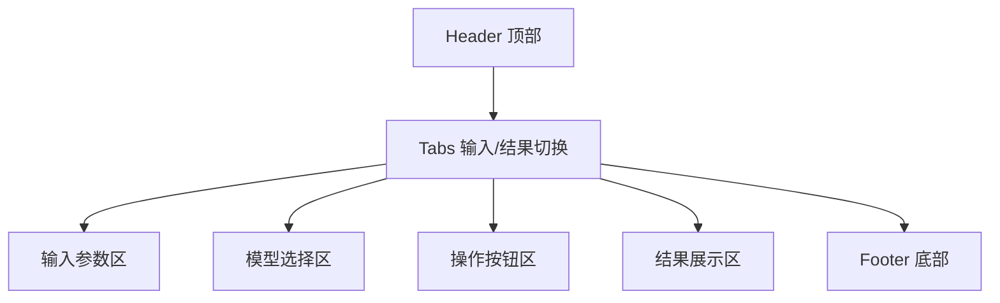

# 固定床反应器工具集统一视觉风格、布局与代码规范方案

---

## 一、视觉风格设计

### 1.1 全局配色与字体
- **主色调**：#6366F1（靛蓝）
- **辅色调**：#1E293B（深蓝灰）
- **强调色**：#F472B6（粉紫）
- **字体**：'Inter', -apple-system, BlinkMacSystemFont, "Segoe UI", Roboto, "Helvetica Neue", Arial, sans-serif
- **字号层级**：
  - 大标题：2.5rem
  - 中标题：1.8rem
  - 正文：1rem

### 1.2 组件样式
- **按钮**：渐变背景，圆角，hover上浮
- **输入框**：圆角，阴影，聚焦高亮
- **卡片**：圆角，阴影，hover上浮
- **动画**：平滑过渡，加载旋转
- **响应式**：支持桌面与移动端

---

## 二、统一版式布局

### 2.1 页面结构
- **Header**：渐变背景，大标题，副标题，返回主页
- **Tabs**：输入参数、计算结果切换
- **输入区**：两栏网格，tooltip提示
- **模型选择区**：checkbox+信息按钮
- **操作按钮区**：计算、清除、重置
- **结果区**：卡片+图表
- **Footer**：版权信息

### 2.2 Mermaid结构图


---

## 三、代码结构与规范

### 3.1 HTML
- 使用语义化标签
- 类名采用BEM命名法
- 模块区块前添加中文注释

### 3.2 CSS
- 全局变量集中在`:root`
- 命名采用BEM
- 重要样式块注释说明
- 响应式断点统一

### 3.3 JavaScript
- 变量、函数：驼峰命名
- 常量：全大写下划线
- 文件名：小写短横线
- 函数注释采用JSDoc风格
```js
/**
 * 计算雷诺数
 * @param {number} velocity - 流体速度 (m/s)
 * @param {number} diameter - 颗粒直径 (m)
 * @param {number} density - 流体密度 (kg/m³)
 * @param {number} viscosity - 流体黏度 (Pa·s)
 * @returns {number} 雷诺数
 */
function calculateReynolds(velocity, diameter, density, viscosity) { ... }
```
- 复杂逻辑块前添加中文注释

### 3.4 目录结构
```
/根目录
│
├─ global-styles.css
├─ index.html
│
├─ 模块目录/
│   ├─ 模块_index.html
│   ├─ 模块_script.js
│   ├─ 模块_theory.md
│
├─ assets/
├─ docs/
│   └─ CODE_STYLE.md
└─ README.md
```

---

## 四、详细执行步骤

### 阶段一：视觉与布局统一
- 引入`global-styles.css`，移除局部冲突样式
- 统一Header、Tabs、输入区、结果区结构
- 确保响应式一致

### 阶段二：代码规范统一
- 统一HTML结构与注释
- 统一CSS命名、变量、注释
- 统一JS命名、结构、注释
- 编写`CODE_STYLE.md`记录规范

### 阶段三：代码重构
- 按规范重构HTML、CSS、JS
- 优化函数封装
- 增强注释
- 测试功能

### 阶段四：交付
- 测试界面与功能
- 交付代码与文档

---

## 五、目标
- **界面一致**，体验连贯
- **代码规范**，易维护
- **协作高效**，便于扩展

---

_此文档为固定床反应器工具集统一设计与开发规范，版本1.0_